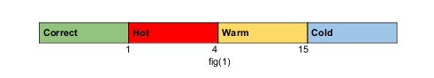

## The application should have the following features.
1. The web app should generate a random number between 1-100. This number
is hidden from the user.

2. Provide an input field to the user. The user should be able to enter only
numbers to this field.

3. Provide a submit button along with the input field.

4. On submit, the user will be given a response, in ref to fig(1)

 

5. The response will be based on the difference between the random number
generated and the user’s input
a. If the difference is 0 you will display ‘Correct!’ - Green
b. If the difference is 1-4 you will display ‘Hot!!’ - Red
c. If the difference is 5-15 you will display ‘Warm’ - Yellow
d. For anything beyond, display ‘Cold’ - Blue

6. The user is allowed to make any number of guesses, until he finds the correct
answer.

7. After guessing correctly, another set of similar UI components should show up
on the screen (Without loosing the previous Input Field and submit button)
below the existing UI.

8. This should start another game with a higher random number bracket (+100)
i.e. 1-200, after this number is guessed, the next game has a higher bracket,
1-300 and so on.

9. All the other rules remain the same. 

## Quick Start

### git clone https://github.com/abhishek2x/Number-Guessing-Web-App.git
#### cd Number-Guessing-Web-App/
#### npm install
#### npm start

> This project is currently hosted at ***https://abhishek2x.github.io/Number-Guessing-Web-App/***

***
This project was bootstrapped with [Create React App](https://github.com/facebook/create-react-app).

## Available Scripts

In the project directory, you can run:

### `npm start`

Runs the app in the development mode. 
Open [http://localhost:3000](http://localhost:3000) to view it in the browser.

The page will reload if you make edits. 
You will also see any lint errors in the console.

### `npm test`

Launches the test runner in the interactive watch mode. 
See the section about [running tests](https://facebook.github.io/create-react-app/docs/running-tests) for more information.

### `npm run build`

Builds the app for production to the `build` folder. 
It correctly bundles React in production mode and optimizes the build for the best performance.

The build is minified and the filenames include the hashes. 
Your app is ready to be deployed!

See the section about [deployment](https://facebook.github.io/create-react-app/docs/deployment) for more information.

### `npm run eject`

**Note: this is a one-way operation. Once you `eject`, you can’t go back!**

If you aren’t satisfied with the build tool and configuration choices, you can `eject` at any time. This command will remove the single build dependency from your project.

Instead, it will copy all the configuration files and the transitive dependencies (webpack, Babel, ESLint, etc) right into your project so you have full control over them. All of the commands except `eject` will still work, but they will point to the copied scripts so you can tweak them. At this point you’re on your own.

You don’t have to ever use `eject`. The curated feature set is suitable for small and middle deployments, and you shouldn’t feel obligated to use this feature. However we understand that this tool wouldn’t be useful if you couldn’t customize it when you are ready for it.

## Learn More

You can learn more in the [Create React App documentation](https://facebook.github.io/create-react-app/docs/getting-started).

To learn React, check out the [React documentation](https://reactjs.org/).

### Code Splitting

This section has moved here: https://facebook.github.io/create-react-app/docs/code-splitting

### Analyzing the Bundle Size

This section has moved here: https://facebook.github.io/create-react-app/docs/analyzing-the-bundle-size

### Making a Progressive Web App

This section has moved here: https://facebook.github.io/create-react-app/docs/making-a-progressive-web-app

### Advanced Configuration

This section has moved here: https://facebook.github.io/create-react-app/docs/advanced-configuration

### Deployment

This section has moved here: https://facebook.github.io/create-react-app/docs/deployment

### `npm run build` fails to minify

This section has moved here: https://facebook.github.io/create-react-app/docs/troubleshooting#npm-run-build-fails-to-minify
# Number-Guessing-Web-App
